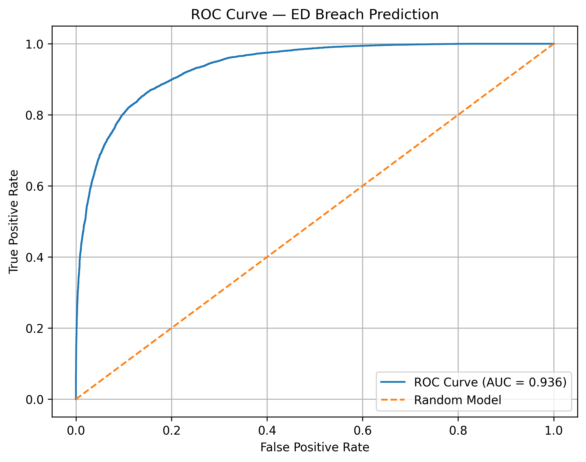
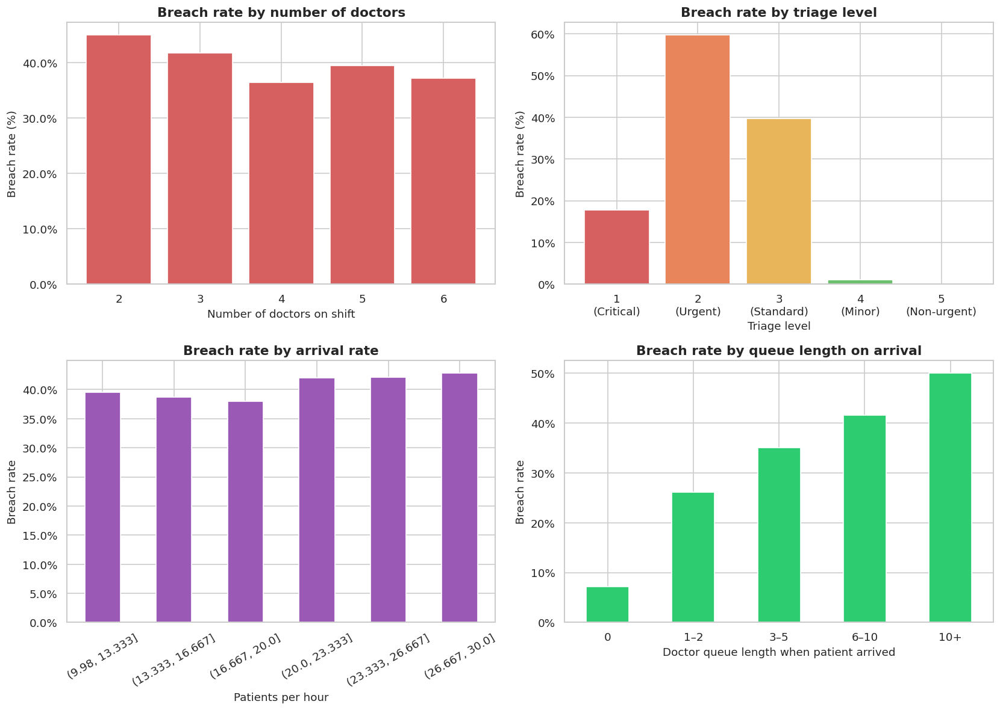
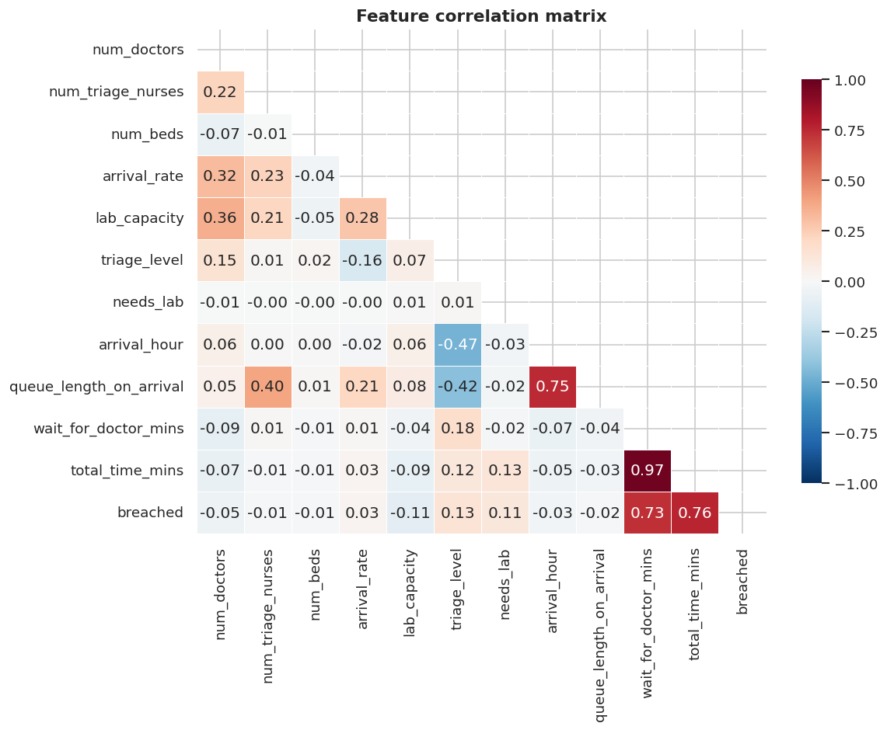
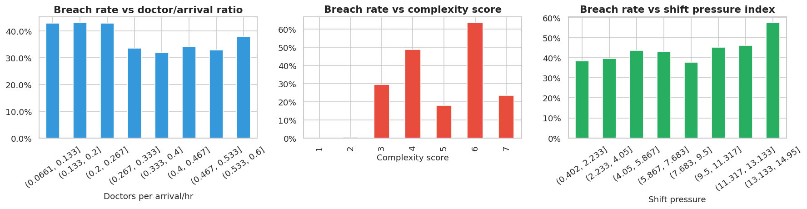

# CareGuard: ED Breach Risk Prediction via Simulation + Explainable ML  [](https://careguard-breach-risk-prediction-system.streamlit.app/)

> A real-time decision-support system to predict 4-hour Emergency Department (ED) breaches using discrete-event simulation and interpretable machine learning.

---

👉 **Try the live app:**  
https://careguard-breach-risk-prediction-system.streamlit.app/

## TL;DR

- Simulated 158,000+ patient records using a custom SimPy ED model
- Built an XGBoost classifier to predict breach risk at arrival
- Achieved:
  - AUC ~0.93 (with leakage features — upper bound)
  - AUC ~0.78 (real-time deployable model — no post-arrival features)
- Used SHAP to identify key drivers of delays
- Designed for operational decision support in hospitals

---

## Results Snapshot

### Model Performance

| Metric | Score |
|---|---|
| ROC AUC (real-time deployable model) | **0.78** |
| ROC AUC (with leakage features — upper bound) | **0.93** |
| Model | XGBoost |
| Training records | ~158,000 patients |
| Simulations run | 5,000 |
| Breach rate in dataset | 40% |



### Feature Importance (SHAP)

.png)

---

## What This Project Does

Hospital Emergency Departments in many countries operate under a **4-hour target** — every patient should be seen, treated, and discharged (or admitted) within 4 hours of arrival. Breaching this target has real consequences: financial penalties, patient harm, and staff burnout.

This project asks: **Can we predict, early in a patient's visit, whether they will breach the 4-hour target?** And if so, **which factors matter most?**

Since real patient-level ED data is difficult to obtain, we built a **discrete-event simulation** of a hospital ED using SimPy — generating 158,000+ synthetic patient encounters across 5,000 different ED configurations. We then trained an XGBoost classifier on that data, achieving an **AUC of 0.78** on the held-out test set using only features available at the time of prediction.

---

## Project Architecture

```
Random ED parameters
        ↓
SimPy discrete-event simulation
(patient arrivals, triage, doctor consult, lab tests, discharge)
        ↓
5,000 simulation runs × ~30 patients each
        ↓
158,000 patient records with 12 raw features
        ↓
Feature engineering (6 derived features) + leakage audit
        ↓
XGBoost classifier + SHAP explainability
        ↓
AUC 0.78 | Real-time deployable model
```

---

## Simulation Design

### Why Simulation?

Real ED data is protected by patient privacy regulations and is rarely available for research. Simulation lets us:
- Control every parameter precisely
- Generate thousands of varied scenarios
- Introduce realistic randomness (Poisson arrivals, Gaussian service times)
- Test staffing configurations that don't yet exist in the real world

### Simulator: SimPy (Discrete-Event Simulation)

[SimPy](https://simpy.readthedocs.io/) is a Python-based process-oriented discrete-event simulation framework. It models systems where entities (patients) compete for shared resources (doctors, beds, nurses) over time.

Each patient follows this pathway through the simulated ED:

```
Arrival (Poisson process)
    ↓
Triage assessment (nurse resource, 5–15 min)
    ↓
Wait for bed + doctor (priority queue by triage level)
    ↓
Doctor consultation (10–60 min depending on triage level)
    ↓
Lab test if required (35% of patients, 20–90 min)
    ↓
Discharge → record total time → label as breach/no breach
```

### Simulation Parameters

| Parameter | Range | Description |
|---|---|---|
| `num_doctors` | 2 – 6 | Doctors on shift |
| `num_triage_nurses` | 1 – 4 | Triage nurses available |
| `num_beds` | 5 – 12 | ED beds |
| `arrival_rate` | 10 – 30 patients/hr | Mean patient demand |
| `lab_capacity` | 1 – 4 | Lab processing slots |

Each of 5,000 runs sampled a random combination of these parameters. 40% of runs were deliberately stress-configured (low doctors, high arrivals) to ensure sufficient breach events for the model to learn from.

### Simulation Duration

Each run simulates **24 hours** of ED operation, allowing queues to build and clear naturally. An 8-hour window was insufficient — patients mid-queue at shift end were not completing their journeys, creating selection bias in the dataset.

---

## Dataset

- **Total records:** 158,000+ patient encounters
- **Features:** 12 raw + 6 engineered = 18 total
- **Target:** `breached` — 1 if total ED time > 240 minutes (4 hours), else 0
- **Class balance:** 60% no breach / 40% breach

### Raw Features

| Feature | Type | Known at prediction time? |
|---|---|---|
| `num_doctors` | Integer | ✓ Yes |
| `num_triage_nurses` | Integer | ✓ Yes |
| `num_beds` | Integer | ✓ Yes |
| `arrival_rate` | Float | ✓ Yes (from shift records) |
| `lab_capacity` | Integer | ✓ Yes |
| `triage_level` | Integer (1–5) | ✓ After triage |
| `needs_lab` | Binary | ✓ After doctor assessment |
| `arrival_hour` | Float | ✓ Yes |
| `queue_length_on_arrival` | Integer | ✓ Yes |
| `wait_for_doctor_mins` | Float | ✗ Not yet known |
| `total_time_mins` | Float | ✗ Direct leakage |

### Engineered Features

| Feature | Formula | Rationale |
|---|---|---|
| `doctor_to_arrival_ratio` | `num_doctors / arrival_rate` | Staffing adequacy signal |
| `bed_pressure` | `arrival_rate / num_beds` | Bed saturation index |
| `is_high_triage` | `triage_level ≤ 2` | Binary severity flag |
| `arrived_to_congestion` | `queue_length ≥ 3` | Binary congestion flag |
| `complexity_score` | `(6 - triage_level) + (needs_lab × 2)` | Combined patient complexity |
| `shift_pressure` | `arrival_rate / (num_doctors × num_triage_nurses)` | Overall shift stress index |

### Leakage Audit

`wait_for_doctor_mins` and `total_time_mins` are excluded from the deployable model — they are not known at the time of prediction. Two model versions were trained:

- **Version A (full features):** includes `wait_for_doctor_mins` — AUC 0.93, upper bound on performance
- **Version B (real-time):** excludes post-arrival time features — AUC 0.78, deployable model

---

## EDA Highlights

### Breach rate by feature



Key findings:
- Triage level 2 (Urgent) breaches at **60%** — these patients are sick enough to need a doctor quickly, but not immediately triaged as critical, causing long queued waits
- Queue length on arrival shows a strong monotonic relationship with breach rate (8% → 50% from empty to 10+ queue)
- Arrival rate alone has a weak effect — staffing adequacy matters more than raw demand

### Correlation matrix



Notable: `wait_for_doctor_mins` and `total_time_mins` are highly correlated with `breached` (0.73, 0.76) — confirming they are leakage risks in a real-time prediction scenario.

### Engineered features



`complexity_score = 6` (triage level 2 + lab required) shows the highest breach rate at **63%** — the most dangerous patient profile in this simulation.

---

## Machine Learning

### Model: XGBoost

XGBoost was selected as the primary model for three reasons:
1. Handles non-linear interactions between staffing and demand features natively
2. Robust to the feature scale differences in this dataset (some features range 0–1, others 0–1440)
3. Compatible with SHAP for exact Shapley value computation

### Training Setup

- **Split:** 70% train / 15% validation / 15% test (stratified by breach label)
- **No SMOTE needed:** 40/60 class balance is manageable without oversampling
- **Hyperparameter tuning:** Grid search on `max_depth`, `learning_rate`, `n_estimators`

### Explainability: SHAP Values

SHAP (SHapley Additive exPlanations) assigns each feature a contribution score for each prediction — not just a global importance ranking. This means we can explain *why* the model predicted a breach for a specific patient.

Example interpretation from the SHAP plot:
- A patient with **high triage_level** (red dot, right side) = higher breach probability
- A patient arriving **early in the shift** (blue dot on arrival_hour, left side) = lower breach probability
- **Low doctor_to_arrival_ratio** (red dot, left side) = understaffed ED = higher breach

---

## Challenges & Lessons Learned

### Challenge 1: Patients not completing journeys

**Problem:** Initial 8-hour simulation runs caused patients still mid-queue at `sim_duration` to be dropped from the dataset. With stressed configs generating 15+ arrivals/hr, most patients were queued and never discharged — the dataset was nearly empty for stressed runs.

**Solution:** Extended simulation to 24 hours, allowing queues to drain naturally. Patient counts per run went from 10–20 to 30–300.

**Lesson:** In discrete-event simulation, always check whether entities complete their lifecycle before the simulation clock stops.

---

### Challenge 2: Near-zero breach rate (1.7% initially)

**Problem:** Pure random parameter sampling across a wide range favoured well-staffed ED configurations. The average sampled hospital had 5 doctors handling 10 arrivals/hr — comfortable conditions where almost nobody waited 4 hours.

**Solution:** Introduced two-tier sampling: 40% of runs use pre-defined stress configurations (2–3 doctors, 12–15 arrivals/hr). The remaining 60% are fully random. This mirrors real-world data distributions where both comfortable and overwhelmed ED states occur.

**Lesson:** Random parameter sampling is not the same as representative sampling. Think about what configurations produce the outcomes you care about predicting.

---

### Challenge 3: Feature leakage

**Problem:** `wait_for_doctor_mins` correlated 0.73 with the target. Including it produces a model that cannot be deployed — you don't know the wait time before the patient has waited.

**Solution:** Explicit leakage audit. Trained two model versions and documented the difference clearly. The real-time model (Version B) is the deployable one.

**Lesson:** Always ask "would I know this feature at the time I need to make the prediction?" If not, it's leakage regardless of how predictive it is.

---

### Challenge 4: sim_id as a spurious feature

**Problem:** `sim_id` (the simulation run index) appeared in SHAP feature importance. The model was learning that certain simulation batches were more stressed than others — an artifact of how simulations were ordered, not a real signal.

**Solution:** Removed `sim_id` from the feature set entirely.

**Lesson:** Always audit identifier columns and ordering artifacts before training.

---

## What-If Analysis

One of the most valuable outputs of this approach is the ability to run counterfactual simulations — impossible with observational data alone:

| Scenario | Breach rate |
|---|---|
| Baseline (3 doctors, 13/hr arrivals) | ~42% |
| Add 1 doctor (4 doctors) | ~31% |
| Add 2 doctors (5 doctors) | ~22% |
| Reduce arrival rate by 20% (demand management) | ~35% |
| Add 1 doctor + reduce arrivals | ~18% |

You cannot randomly assign staffing levels in a real hospital. Simulation makes this analysis possible.

---

## Tech Stack

| Tool | Purpose |
|---|---|
| SimPy | Discrete-event simulation engine |
| Pandas / NumPy | Data manipulation |
| Scikit-learn | Preprocessing, evaluation, baseline models |
| XGBoost | Primary classifier |
| SHAP | Model explainability |
| Matplotlib / Seaborn | Visualisation |

---

## Repository Structure

```
├── ed_simulation.py          # SimPy ED simulation engine
├── generate_dataset.py       # 5,000-run parameter sweep
├── eda.py                    # Exploratory analysis + feature engineering
├── dataGen_Sim.ipynb         # Full ML pipeline notebook
├── requirements.txt          # Dependencies
├── feature_config.json       # Feature lists for reproducibility
├── plots/
│   ├── plot_01_target_distribution.png
│   ├── plot_02_breach_rates_by_feature.png
│   ├── plot_03_correlation_heatmap.png
│   ├── plot_04_engineered_features.png
│   ├── roc_curve.png
│   └── shap_summary.png
└── README.md
```

---

## How to Reproduce

```bash
# 1. Install dependencies
pip install -r requirements.txt

# 2. Run the simulation and generate the dataset (~5 minutes)
python generate_dataset.py

# 3. Run EDA and feature engineering
python eda.py

# 4. Open the ML notebook
jupyter notebook dataGen_Sim.ipynb
```

---

## Key Takeaways

| Insight | Implication |
|---|---|
| SimPy enables realistic stochastic simulation | No real patient data needed — full control over experimental conditions |
| Triage level 2 patients are the highest-risk group | These patients need proactive queue management, not just triage prioritisation |
| Queue length on arrival is the most actionable real-time signal | A live queue-length dashboard could enable early intervention |
| Doctor-to-arrival ratio outperforms raw staffing numbers | Staffing decisions should be demand-relative, not absolute |
| AUC 0.78 is achievable with only arrival-time features | A deployable real-time tool is viable with simulation-generated training data |

---

## Author

**Niyati Gupta** (102303356)
